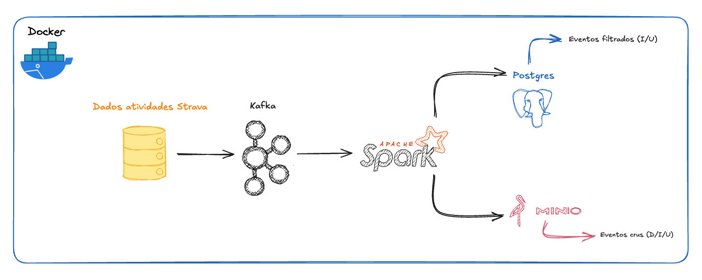

# Pipeline de Change Data Capture com Kafka, Debezium, Spark, Postgres e MinIO

Projeto educacional construído para demonstrar, na prática, o
funcionamento de um pipeline de CDC e input em bucket e banco de dados relacional usando dados fake do Strava.

## 🗂️ Sumário

-   [🎯 Objetivo do Projeto](#-objetivo-do-projeto)
-   [🏗 Arquitetura Geral](#-arquitetura-geral)
-   [📁 Estrutura do Repositório](#-estrutura-do-repositório)
-   [🧰 Tecnologias Utilizadas](#-tecnologias-utilizadas)
-   [🚀 Como Executar o Projeto](#-como-executar-o-projeto)
-   [🧪 Como Testar os Eventos CDC](#-como-testar-os-eventos-cdc)
-   [📦 Conectores Kafka Connect](#-conectores-kafka-connect)
-   [🗄️ Scripts SQL](#%EF%B8%8F-scripts-sql)
-   [📝 Exemplos de Eventos](#-exemplos-de-eventos-cdc)
-   [⚠️ Observações Importantes](#%EF%B8%8F-observações-importantes)
-   [👩‍💻 Autora](#-autora)

------------------------------------------------------------------------

# 🎯 Objetivo do Projeto

Este projeto demonstra um pipeline simples e funcional de CDC (Change
Data Capture) e input de eventos aplicando: 
- Captura de mudanças em tabela Postgres (dados fake do Strava) 
- Publicação de eventos CDC no Kafka 
- Uso de Spark para consolidar eventos: 
- 🐘 Postgres (eventos filtrados) 
- 🪣 MinIO (eventos crus)

------------------------------------------------------------------------

# 🏗 Arquitetura Geral

 
------------------------------------------------------------------------

# 📁 Estrutura do Repositório

    CDC-Strava/
    ├── bash_exec/
    │   ├── 01-exec_init.sh
    │   ├── 02-exec_debezium.sh
    │   ├── 03-exec_cdc.sh
    │   ├── 04-exec_spark_to_minio.sh
    │   ├── 05-exec_spark_to_postgres.sh
    │
    ├── connectors/
    │   ├── source-postgres-strava.json
    │
    ├── docs/
    │   ├── prints e diagramas diversos
    │   └── arquitetura_CDC_Strava.png
    │
    ├── scripts/
    │   ├── input_strava_init.sql
    │   └── cdc_create_events_change.sql
    │  
    ├── spark/
    │   ├── kafka_to_minio.py
    │   ├── kafka_to_postgres.py        
    │
    ├── docker-compose.yml
    ├── Dockerfile.connect
    └── README.md

------------------------------------------------------------------------

# 🧰 Tecnologias Utilizadas

  Tecnologia          Função
  ------------------- ----------------------------------------
  **Docker**          Ambientes isolados
  **PostgreSQL**      Fonte de dados fake + destino filtrado
  **Kafka**           Mensageria para eventos CDC
  **Debezium**        Captura de mudanças
  **Kafka Connect**   Execução de conectores
  **MinIO**           Armazenamento S3-like
  **Spark**           Camada intermediria em streaming para gerar dados no Minio e Postgress
  **Bash Scripts**    Automação do pipeline

------------------------------------------------------------------------

# 🚀 Como Executar o Projeto

Subir o ambiente

docker compose up -d

## 1️⃣ Criar tabelas fake

    bash bash_exec/01-exec_init.sh

## 2️⃣ Fazer modificações nos dados

    bash bash_exec/03-exec_cdc.sh

## 3️⃣ Criar conector Debezium para gerar um ambiente de CDC

    bash bash_exec/02-exec_debezium.sh

## 4️⃣ Execuções do spark para minio raw e postgres com filtro de delete

    bash bash_exec/04-exec_spark_to_minio.sh
    bash bash_exec/05-exec_spark_to_postgres.sh 

------------------------------------------------------------------------

# 🧪 Como Testar os Eventos CDC

### Consumir mensagens no Kafka:

    docker exec -it kafka_cdc_strava kafka-console-consumer   --bootstrap-server localhost:9092   --topic strava.activities   --from-beginning

### Ver arquivos crus no MinIO:

Acessar: http://localhost:9011

### Ver tabela do Postgress:

    docker compose exec -T postgres_dest_cdc_strava psql -U postgres -d strava_dest -c "select count(*) from silver_strava_activities;"

------------------------------------------------------------------------

# 📦 Conectores Kafka Connect

## 🔹 source-postgres-strava.json

Monitora tabela Postgres e envia eventos CDC ao Kafka.

------------------------------------------------------------------------

# 🗄️ Scripts SQL

  --------------------------------------------------------------------------
  Script                           Descrição
  -------------------------------- -----------------------------------------
  `input_strava_init.sql`          Cria & insere dados fake

  `cdc_create_events_change.sql`   Configura estruturas auxiliares para CDC
  --------------------------------------------------------------------------

------------------------------------------------------------------------

# 📝 Exemplos de execuções

Disponíveis em `docs/`

------------------------------------------------------------------------

# ⚠️ Observações Importantes

-   Todos os dados são fake.
-   Projeto totalmente local.
-   Configurações podem variar conforme seu docker-compose.

------------------------------------------------------------------------

# 👩‍💻 Autora

Rayane Correia — Analytics Engineer | Pós-graduação em Engenharia de Dados – UNIFOR
